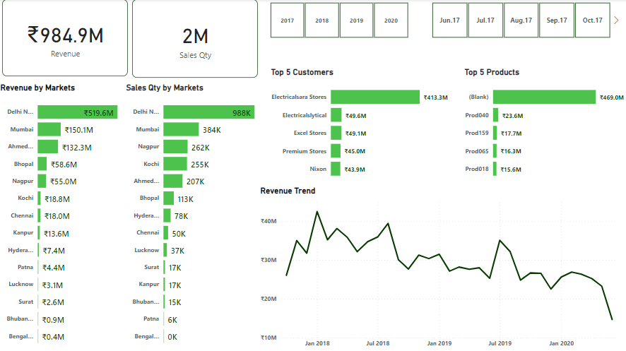
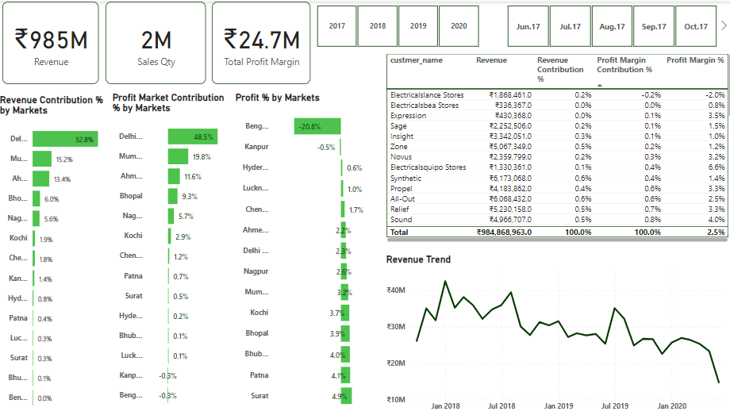
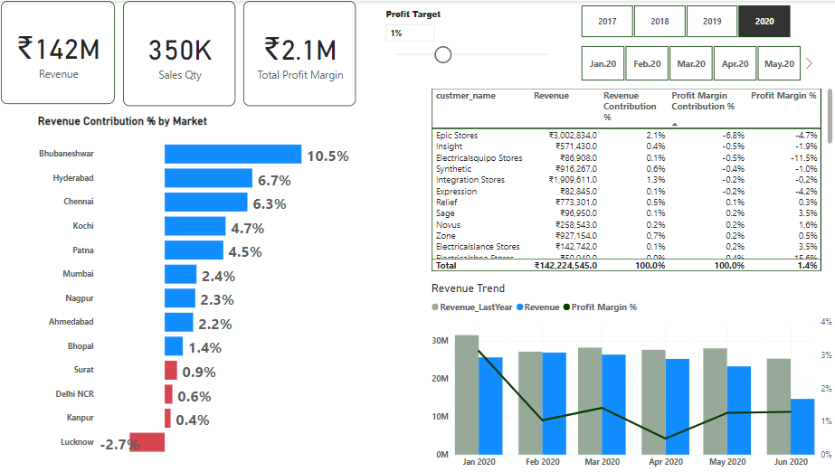

# Sales Insights


### Table of Contents
- [Introduction](#Introduction)
- [Problem Statement](#Problem-Statement)
- [Data Sourcing](#Data-Sourcing)
- [Analysis and Visualization](#Analysis-and-Visualization)
- [Conclusion and Recommendation](#Conclusion-and-Recommendation)

## Introduction
This project is inspired by codebasics. With this dataset, I get to practice my data cleaning, analysis, and visualization skills.

I got to know more about DAX Concepts: Calculated column, Custom column

It is a star schema model with ***TRANSACTIONS*** table as the Fact Table and the rest as Dimension Table.

## Problem Statement
A manufacturing company in India supplies computer hardware to various regions in India. The sales director is looking to track sales and get insights into North India, South, and 
Central India. 

He wants to know the following:

-	Total Revenue and Total Sales Quantity from 2017 – 2020 and the zone that generates more
-	Top 5 Customers and Products 
-	Performance of Sales
-	What is the profit for each market, and product?
-	Which markets run in loss?

## Data Sourcing
I imported the data into MySQL and performed exploratory data analysis using SQL like

```sql

SELECT SUM(transactions.sales_amount)
FROM transactions
INNER JOIN date
ON transactions.order_date=date.date 
WHERE date.year=2020 AND transactions.currency="INR\r" or transactions.currency="USD\r";

``` 

***(To show the total revenue in the year 2020)***

```sql

SELECT distinct product_code
FROM transactions
WHERE market_code='Mark001';

```

***(To show distinct product sold in Chennai)***

The database is made up of 5 tables:

1.	CUSTOMERS with 3 columns and 38 rows
2.	DATE with 5 columns and 1126 rows
3.	MARKETS with 3 columns and 17 rows
4.	PRODUCTS with 2 columns and 279 rows
5.	TRANSACTIONS with 10 columns and 148395 rows

## Data Transformation
The data was imported into PowerBI and transformed using the Power Query. The data didn’t need much cleaning.

- I filtered all blanks and negative numbers
- I created a  _***norm_sales_amount***_ column to convert all currencies to INR
- I Changed the data type of the new column created from TEXT to DECIMAL

## Data Analysis and Visualization
Visuals                           |                          Insights
:--------------------------------:|:--------------------------------------------------------------------------------------------------:
             |  Delhi NCR generated more revenue and sales in quantity. In the year 2020, sales began to decline
          |  Even with a very low-profit margin, the Top 5 Customers were able to generate more sales in volume that is they still get more orders
     |  Having a profit target, we can be able to see the customers, and markets that gain and the ones that run-in loss

## Conclusion and Recommendation
The sales director can focus on some particular markets and increase delivery to zones that sell more.

Customers who do not generate much revenue or run into a loss should engage in promoting and advertising products or improve their marketing techniques. They should also give discounts, and check the quality of their products.

---------

Interact with the dashboard [Here](https://app.powerbi.com/view?r=eyJrIjoiMTE0MmY0NjktOWJjYy00MzRhLWE3ZDMtMmQxNGE1NWUyZjU5IiwidCI6ImFiYjU3ODg3LTNmY2ItNDgyNy1iODJiLThiZjU4ZWRjNTlhYSJ9)


***Thank you 😄***


